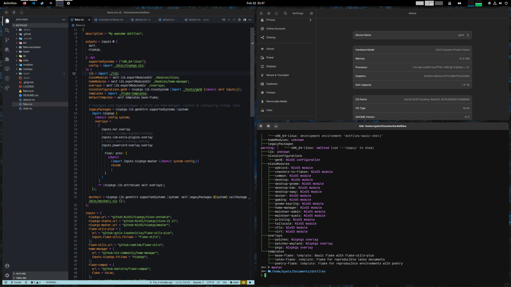

<h1 align="center">viperML/dotfiles</h1>


<p align="center">
  <a href="https://github.com/viperML/dotfiles/actions/workflows/flake-check.yaml">
  
  </a>
  <a href="https://github.com/viperML/dotfiles/actions/workflows/flake-cache.yaml">
  
  </a>
  <a href="https://github.com/kamadorueda/alejandra">
  
  </a>
  <a href="https://github.com/viperML/dotfiles/actions/workflows/g-neovim-release.yaml">
  
  </a>
</p>

# 🗒 About

These are my personal configuration files for my Linux and Windows machines. Feel free to grab anything that you find interesting.

<div align="center">
  <div style="display: flex; align-items: flex-start;">
    
  </div>
</div>


This repo provides a [nix flake](https://nixos.wiki/wiki/Flakes) which [NixOS](https://nixos.wiki/wiki/NixOS) and [home-manager](https://github.com/nix-community/home-manager) configuration, along with an overlay for packages.

You can directly reference this flake and import it into your NixOS configuration, but you may want to copy code snippets instead.

- [modules](modules): NixOS and home-manager configurations
- [hosts](hosts): host-specific configuration
- [overlays](overlays): new packages and patches
- [lib](lib): utility functions.
- [bin](bin): various scripts
- [flake-template](flake-template): flake templates
- [misc](misc): anything else
- [misc/img](misc/img): a look into the past


# 💾 Resources

- [flake-utils-plus](https://github.com/gytis-ivaskevicius/flake-utils-plus)
- [gytis-ivaskevicius/nixfiles](https://github.com/gytis-ivaskevicius/nixfiles)
- [fufexan/dotfiles](https://github.com/fufexan/dotfiles)
- [Mic92/dotfiles](https://github.com/Mic92/dotfiles)
- [colemickens/nixcfg](https://github.com/colemickens/nixcfg)
- [nuxshed/dotfiles](https://github.com/nuxshed)


# 📦 Exported packages

Install directly from the `packages` output. For example:

```nix
# flake.nix
{
  inputs.viperML-dotfiles.url = github:viperML/dotfiles;
  # Override my nixpkgs
  # Binary cache may have less hits
  inputs.viperML-dotfiles.inputs.nixpkgs.follows = "nixpkgs";

  # ...
}

# configuration.nix
{ config, pkgs, inputs, ... }:
{
  environment.systemPackages = [
    inputs.viperML-dotfiles.packages.${pkgs.system}.thePkgName
  ];
}
```

A package cache is provided:

```nix
# configuration.nix
{ config, pkgs, ... }: {
  nix.extraOptions = ''
    extra-substituters = https://viperml.cachix.org
    extra-trusted-public-keys = viperml.cachix.org-1:qZhKBMTfmcLL+OG6fj/hzsMEedgKvZVFRRAhq7j8Vh8=
  '';
}
```

# g-neovim


My neovim is exported with its configuration and plugins under the name `g-neovim`.

To run it:

```console
nix run github:viperML/dotfiles#g-neovim
```

I also build .DEB and .RPM bundles, that you can [download from CI](https://github.com/viperML/dotfiles/blob/master/.github/workflows/g-neovim-release.yaml)
