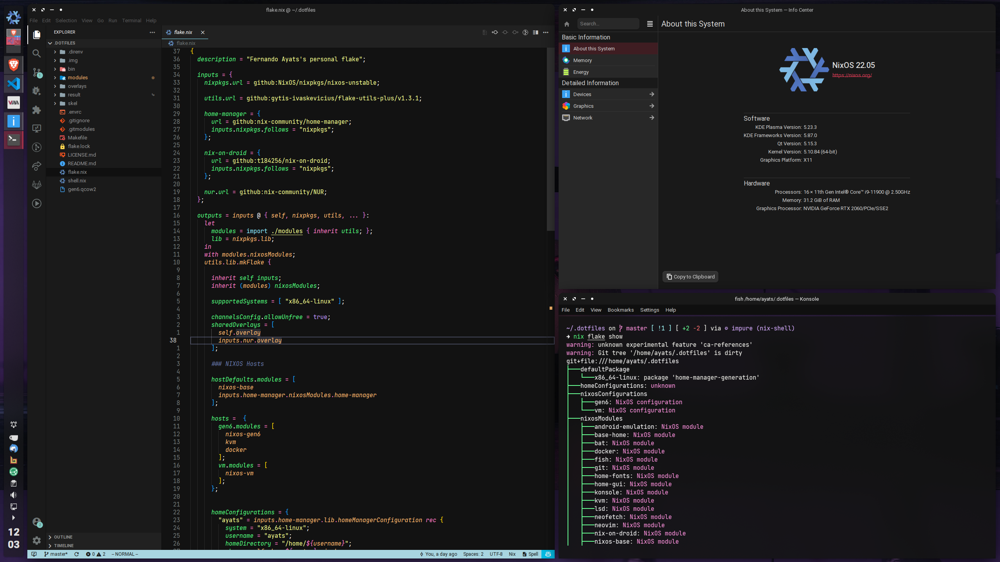

<h1 align="center">viperML/dotfiles</h1>


<p align="center">
  <a href="https://github.com/viperML/dotfiles/actions/workflows/flake-check.yaml">
    
  </a>
  <a href="https://github.com/viperML/dotfiles/actions/workflows/flake-cache.yaml">
    
  </a>
</p>

# 🗒 About

These are my personal configuration files for my Linux and Windows machines. Feel free to grab anything that you find interesting.

<div align="center">
  <div style="display: flex; align-items: flex-start;">
    
  </div>
</div>

This repo provides a [nix flake](https://nixos.wiki/wiki/Flakes) which [NixOS](https://nixos.wiki/wiki/NixOS) and [home-manager](https://github.com/nix-community/home-manager) configuration, along with an overlay for packages.

You can directly reference this flake and import it into your NixOS configuration, but you may want to copy code snippets instead.

- [modules](modules): NixOS and home-manager modules to import into the configurations. Generic config files are stored into [moudules/misc](modules/misc).
- [overlay](overlay): Nixpkgs/overrides packaged by me for personal use. Can be imported into any flake.
- [lib](lib): Nix utility functions.
- [bin](bin): Various scripts
- [templates](templates): Template files for various projects.
- [.img](.img): A look into the past


# 💾 Resources

- [flake-utils-plus](https://github.com/gytis-ivaskevicius/flake-utils-plus): library to help with flakes
- [gytis-ivaskevicius/nixfiles](https://github.com/gytis-ivaskevicius/nixfiles): flake-utils-plus's author flake, from which I ~~stole~~ took heavy inspiration

> Last update of this README: January 2022


# 📦 Exported packages

You can either:
- Pull the whole package into nixpkgs, and reference any package:


```nix
# flake.nix
{
  # ...
  inputs.viperML-dotfiles.url = github:viperML/dotfiles;

  outputs  = inputs@{ ... }: {
    nixosConfigurations.<hostname> = nixpkgs.lib.nixosSystem {
      # ...
      modules = [
        {
          nixpkgs.overlays = [
            inputs.viperML-dotfiles.overlay-pkgs
          ];
          environment.systemPackages = [
            <pkg>
          ];
        }
      ];
    };
  }
}
```

- Or reference specific packages, such as:

```nix
# configuration.nix
{ inputs, ... }: {
  environment.systemPackages = [
    # ...
    inputs.viperML-dotfiles.pkgs.x86_64-linux.<pkg>`
  ];
}
```
Packages are built and pushed to a public cachix cache, according to [.github/build-pkgs.sh](build-pkgs.sh). You can use the binary cache with:

```nix
# configuration.nix
{ config, pkgs, ... }: {
  nix.extraOptions = ''
    extra-substituters = https://viperml.cachix.org
    extra-trusted-public-keys = viperml.cachix.org-1:qZhKBMTfmcLL+OG6fj/hzsMEedgKvZVFRRAhq7j8Vh8=
  '';
}
```


<!--BEGIN-->
```json
{
  "x86_64-linux": {
    "adwaita-plus": {
      "name": "adwaita-plus-unstable",
      "type": "derivation"
    },
    "any-nix-shell": {
      "description": "fish and zsh support for nix-shell",
      "name": "any-nix-shell-1.2.1",
      "type": "derivation"
    },
    "bdcompat": {
      "name": "bdCompat-unstable-2021-11-10",
      "type": "derivation"
    },
    "disconnect-tracking-protection": {
      "description": "Tracking protection lists and services",
      "name": "disconnect-tracking-protection-unstable-2022-02-01",
      "type": "derivation"
    },
    "g-kitty": {
      "description": "A modern, hackable, featureful, OpenGL based terminal emulator",
      "name": "kitty-unstable-2022-02-07",
      "type": "derivation"
    },
    "g-papirus-icon-theme": {
      "description": "Papirus icon theme, patched with folder colorscheme",
      "name": "papirus-icon-theme-20211001",
      "type": "derivation"
    },
    "multiload-ng": {
      "description": "Modern graphical system monitor for any panel (only systray and standalone builds)",
      "name": "multiload-ng-unstable-2021-01-03",
      "type": "derivation"
    },
    "netboot-xyz-images": {
      "description": "netboot.xyz bootloader images, uefi and legacy",
      "name": "netboot-xyz-images-2.0.54",
      "type": "derivation"
    },
    "obsidian": {
      "description": "A powerful knowledge base that works on top of a local folder of plain text Markdown files",
      "name": "obsidian-0.12.19",
      "type": "derivation"
    },
    "plasma-applet-splitdigitalclock": {
      "description": "Split Digital Clock",
      "name": "plasma-applet-splitdigitalclock-unstable-2021-12-27",
      "type": "derivation"
    },
    "python3": {
      "description": "A high-level dynamically-typed programming language",
      "name": "python3-3.9.6",
      "type": "derivation"
    },
    "stevenblack-hosts": {
      "description": "Unified hosts file with base extensions",
      "name": "stevenblack-hosts-unstable-2022-02-07",
      "type": "derivation"
    },
    "vlmcsd": {
      "description": "KMS Emulator written in C",
      "name": "vlmcsd-unstable-2020-05-19",
      "type": "derivation"
    }
  }
}
```
<!--END-->
